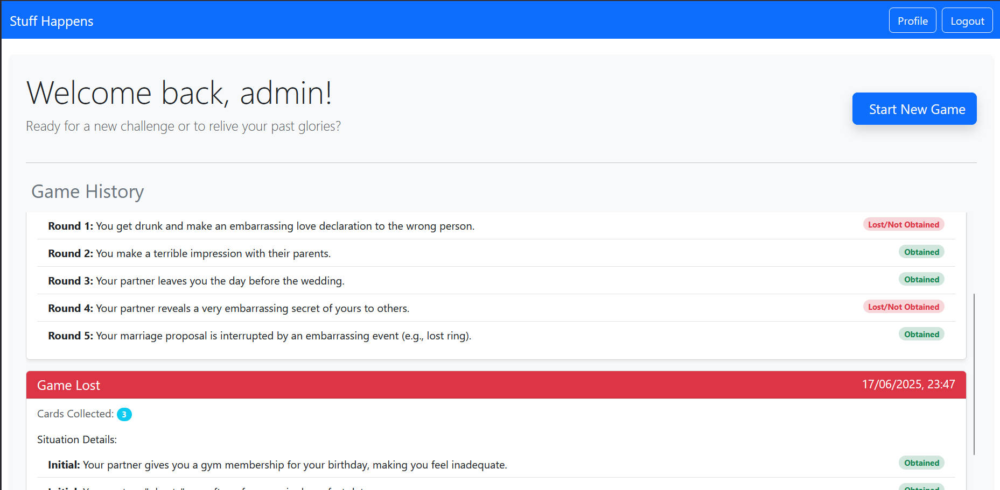
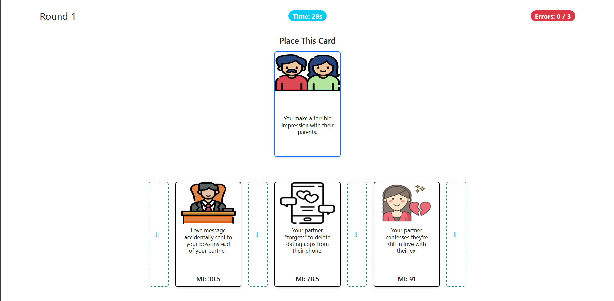

[](https://classroom.github.com/a/uNTgnFHD)
# Exam #1: "Stuff Happens"

## Student: s339239 FAVOLE LUCA

## React Client Application Routes

- `/`  
  MainPage: displays the game rules and a Try Demo Game button.

- `/login`  
  LoginForm: user authentication; redirects logged-in users to `/PersonalPage`.

- `/PersonalPage`  
  PersonalPage: user dashboard with profile info and game history (protected).

- `/Game/:gameId`  
  Game: shows three initial cards and a Start Game button.

- `/Game/:gameId/demo`  
  GameDemo: single-round demo for guests or authenticated users.

- `/Game/:gameId/round/:roundId`  
  GameRound: active round with challenge card, countdown timer, placement slots, and owned cards.

- `/Game/:gameId/round/:roundId/endround`  
  GameEndRound: displays round result, won-card preview (if correct), and Next Round or View Final Results button.

- `/Game/:gameId/endgame`  
  GameEndGame: final summary of collected cards and errors, plus Start New Game and Back to Profile buttons.

- `*`  
  NotFound: fallback 404 page.

## API Server

- **POST** `/api/sessions`
  - Body: `{ "username": "string", "password": "string" }`
  - Response 201: authenticated user object
  - Example:
    ```
    Request:
    POST /api/sessions
    {
      "username": "luca",
      "password": "123456"
    }

    Response:
    {
      "id": 1,
      "username": "luca",
      "name": "Luca Favole"
    }
    ```

- **DELETE** `/api/sessions/current`
  - Response 204: no content
  - Example:
    ```
    Request:
    DELETE /api/sessions/current

    Response:
    (No content)
    ```

- **GET** `/api/sessions/current`
  - Response 200: user object if authenticated
  - Response 401: `{ "error": "Unauthenticated" }`
  - Example:
    ```
    Request:
    GET /api/sessions/current

    Response (authenticated):
    {
      "id": 1,
      "username": "luca",
      "name": "Luca Favole"
    }

    Response (unauthenticated):
    {
      "error": "Unauthenticated"
    }
    ```

- **GET** `/api/history`
    - No request body
    - Response 200: array of past game records
    ```
    {
      "id": number,
      "username": string,
      "name": string,
      "gameHistory": [
        {
          "id": number,
          "outcome": "Won" | "Lost",
          "date": string, // ISO 8601 format
          "totalCardsCollected": number,
          "cardsPlayed": [
            {
              "round": number, // 0 for initial cards
              "situation": string, // card name
              "won": boolean // true if the card was obtained
            }
          ]
        }
      ]
    }
    ```
  - Example:
    ```
    Request:
    GET /api/users/1/history

    Response:
    {
      "id": 1,
      "username": "luca",
      "name": "Luca Favole",
      "gameHistory": [
        {
          "id": 101,
          "outcome": "Won",
          "date": "2023-10-01T14:30:00.000Z",
          "totalCardsCollected": 6,
          "cardsPlayed": [
            { "round": 1, "situation": "Car accident", "won": true },
            { "round": 2, "situation": "House fire", "won": false }
          ]
        },
        {
          "id": 102,
          "outcome": "Lost",
          "date": "2023-10-02T15:00:00.000Z",
          "totalCardsCollected": 3,
          "cardsPlayed": [
            { "round": 1, "situation": "Flood", "won": true },
            { "round": 2, "situation": "Earthquake", "won": false }
          ]
        }
      ]
    }
    ```

- **POST** `/api/games`
  - No request body
  - Response 201:
    ```
    {
      "gameId": number,
      "initialCards": [
        { "id": number, "name": string, "image_filename": string, "misfortune_index": number },
        …
      ]
    }
    ```
  - Example:
    ```
    Request:
    POST /api/games

    Response:
    {
      "gameId": 201,
      "initialCards": [
        { "id": 1, "name": "Car accident", "image_filename": "car_accident.jpg", "misfortune_index": 25.5 },
        { "id": 2, "name": "House fire", "image_filename": "house_fire.jpg", "misfortune_index": 50.0 },
        { "id": 3, "name": "Flood", "image_filename": "flood.jpg", "misfortune_index": 75.0 }
      ]
    }
    ```

- **POST** `/api/games/:gameId/new-card`
  - URL param: `gameId`
  - Response 200:
    ```
    { "id": number, "name": string, "image_filename": string }
    ```
  - Example:
    ```
    Request:
    POST /api/games/201/new-card

    Response:
    {
      "id": 4,
      "name": "Earthquake",
      "image_filename": "earthquake.jpg"
    }
    ```

- **POST** `/api/games/:gameId/round`
  - URL param: `gameId`
  - Body: `{ "positionIndex": number }`
  - Response 200:
    ```
    {
      "isCorrect": boolean,
      "newCard": { "id": number, "name": string, "image_filename": string, "misfortune_index": number } | null,
      "ownedCards": [ … ],
      "errors": number,
      "round": number,
      "outcome": "playing" | "won" | "lost"
    }
    ```
  - Example:
    ```
    Request:
    POST /api/games/201/round
    {
      "positionIndex": 2
    }

    Response:
    {
      "isCorrect": true,
      "newCard": { "id": 4, "name": "Earthquake", "image_filename": "earthquake.jpg", "misfortune_index": 60.0 },
      "ownedCards": [
        { "id": 1, "name": "Car accident", "image_filename": "car_accident.jpg", "misfortune_index": 25.5 },
        { "id": 2, "name": "House fire", "image_filename": "house_fire.jpg", "misfortune_index": 50.0 },
        { "id": 4, "name": "Earthquake", "image_filename": "earthquake.jpg", "misfortune_index": 60.0 }
      ],
      "errors": 0,
      "round": 2,
      "outcome": "playing"
    }
    ```

- **GET** `/api/games/:gameId/state`
  - URL param: `gameId`
  - Response 200:
    ```
    {
      "ownedCards": [ … ],
      "state": "PLAYING" | "WON" | "LOST",
      "errors": number,
      "round": number
    }
    ```
  - Example:
    ```
    Request:
    GET /api/games/201/state

    Response:
    {
      "ownedCards": [
        { "id": 1, "name": "Car accident", "image_filename": "car_accident.jpg", "misfortune_index": 25.5 },
        { "id": 2, "name": "House fire", "image_filename": "house_fire.jpg", "misfortune_index": 50.0 },
        { "id": 4, "name": "Earthquake", "image_filename": "earthquake.jpg", "misfortune_index": 60.0 }
      ],
      "state": "PLAYING",
      "errors": 1,
      "round": 2
    }
    ```

## Database Tables

### Users
| Column   | Type    | Constraints                |
|----------|---------|----------------------------|
| id       | INTEGER | PRIMARY KEY, AUTOINCREMENT |
| name     | TEXT    | NOT NULL                   |
| username | TEXT    | NOT NULL, UNIQUE           |
| password | TEXT    | NOT NULL                   |
| salt     | TEXT    | NOT NULL                   |

### Cards
| Column           | Type    | Constraints                                 |
|------------------|---------|---------------------------------------------|
| id               | INTEGER | PRIMARY KEY, AUTOINCREMENT                  |
| name             | TEXT    | NOT NULL                                    |
| image_filename   | TEXT    | NOT NULL                                    |
| misfortune_index | REAL    | NOT NULL, UNIQUE, CHECK (0.5 ≤ value ≤ 100) |

### Games
| Column         | Type     | Constraints                            |
|----------------|----------|----------------------------------------|
| id             | INTEGER  | PRIMARY KEY, AUTOINCREMENT             |
| user_id        | INTEGER  | REFERENCES Users(id) ON DELETE CASCADE |
| date           | DATETIME | DEFAULT CURRENT_TIMESTAMP              |
| outcome        | TEXT     | CHECK (outcome IN ('won','lost'))      |
| final_score    | INTEGER  |                                        |
| last_card_time | DATETIME |                                        |

### GameDetails
| Column          | Type    | Constraints                                                   |
|-----------------|---------|---------------------------------------------------------------|
| game_id         | INTEGER | PRIMARY KEY NOT NULL, REFERENCES Games(id) ON DELETE CASCADE  |
| card_id         | INTEGER | PRIMARY KEY NOT NULL, REFERENCES Cards(id) ON DELETE RESTRICT |
| round_presented | INTEGER |                                                               |
| status          | TEXT    | NOT NULL, CHECK (status IN ('initial','won','lost'))          |


## Main React Components
- `GameRound` (in `GameRound.jsx`):  
  Manages a single game round, displaying the timer, owned cards, the challenge card, and placement slots. The user has 30 seconds to choose where to insert the new card based on the misfortune index, with up to three mistakes allowed. After time runs out or a choice is made, the game proceeds by showing the round result and updating the owned cards. Any errors or messages are displayed to inform the user of the outcome.

- `MainPage` (in `MainPage.jsx`):  
  Represents the game's landing page, explaining the rules and offering the option to start a demo game. Handles loading states and displays errors if the demo cannot be started. Registered users can access the full game, while visitors can try a single demo round.

- `NavHeader` (in `NavHeader.jsx`):  
  Displays the main application header and navigation menu. Shows the game title, navigation links, and login/logout button depending on user authentication status. Provides quick access to the profile when the user is logged in.

- `AuthComponents` (in `AuthComponents.jsx`):  
  Contains authentication components, such as the login form and logout button. Handles credential submission, displays error messages on failed authentication, and provides visual feedback during login or logout processes.

- `DefaultLayout` (in `DefaultLayout.jsx`):  
  Defines the app's base layout, including the navigation header and display of any global messages. Uses the `Outlet` component to dynamically render child pages and show informational alerts to the user.

- `Game` (in `Game.jsx`):  
  Manages the display of a game's initial cards and the game state for authenticated users. Allows starting the first round, displays any loading errors, and updates the list of owned cards in real time.

- `GameComponents` (in `GameComponents.jsx`):  
  Contains reusable visual components for displaying cards and placement slots. These components are used throughout the game to show owned cards, the challenge card, and possible insertion positions.

- `GameDemo` (in `GameDemo.jsx`):  
  Handles the game's demo mode, letting visitors try a single round. Displays the timer, owned cards, challenge card, and the result of the demo round, with options to retry or return to the home page.

- `GameEndGame` (in `GameEndGame.jsx`):  
  Shows the end-of-game screen, indicating whether the user won or lost. Displays the number of collected cards, mistakes made, and allows starting a new game or returning to the personal profile. Handles errors during the final state loading.

- `GameEndRound` (in `GameEndRound.jsx`):  
  Displays the result of the just-finished round, indicating if the choice was correct and updating owned cards and error count. Allows proceeding to the next round or viewing final results in case of victory or defeat.

- `PersonalPage` (in `PersonalPage.jsx`):  
  Represents the user's personal page, showing the history of played games and details of collected cards. Encourages the user to start a new challenge or review past results, and handles cases where user data or history are unavailable.

## Screenshot



## User Credentials
- **admin** / **password** (without any games in history)
- **luca** / **123456**  (with some games in history)

